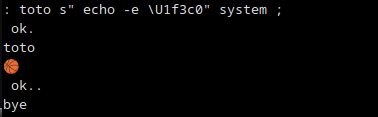

# Bashforth

Will I guess only add few more words to get it better & more usable. I will never try to have a full ANS forth compatibility.

If you need a full forth, prefer gnu-forth, swiftforth, figforth, pforth, or any other interpreter. Here is a bash exercise at first ! 

# already usable 

```
francois@francoisPCTP:~/GITLAB/dev/dev_bash_forthinterpreter$ cat > helloworld.fs
: hello 2 dup 0 do cr loop ." HELLO WORLD" 1 + 0 do cr loop ; 
hello
bye
francois@francoisPCTP:~/GITLAB/dev/dev_bash_forthinterpreter$ ./bashforth.sh helloworld.fs 


HELLO WORLD


francois@francoisPCTP:~/GITLAB/dev/dev_bash_forthinterpreter$
francois@francoisPCTP:~/GITLAB/dev/dev_bash_forthinterpreter$ ./bashforth.sh lib/timestable.fs


 1  2  3  4  5  6  7  8  9 10 
 2  4  6  8 10 12 14 16 18 20 
 3  6  9 12 15 18 21 24 27 30 
 4  8 12 16 20 24 28 32 36 40 
 5 10 15 20 25 30 35 40 45 50 
 6 12 18 24 30 36 42 48 54 60 
 7 14 21 28 35 42 49 56 63 70 
 8 16 24 32 40 48 56 64 72 80 
 9 18 27 36 45 54 63 72 81 90 
10 20 30 40 50 60 70 80 90 100 


francois@francoisPCTP:~/GITLAB/dev/dev_bash_forthinterpreter$ cat lib/timestable.fs

: timestable
cr cr
11 1 do
	11 1 do
		j i * dup 10 < if space then .
	loop
	cr
loop
cr cr ; 
timestable bye
```

# will now include a forth written words library 

default will be named library.fs

[lib](./lib/)

while in bashforth interpreter :

```
include lib/library.fs
```

# keep bash interaction available



# forked on Tue Jul 18 2023

This Forth interpreter, entirely written as bash script, is a F³ (Fully Functional Forth), albeit a tad slow.
Some would call it "sluggish". As rough indication, an ARM SBC which I'm running Bashforth on takes about 15 second
for an empty loop of 100,000 iterations. It has built-in _doc_ and _see_ facilities, simplifying exploration of Bashforth.
Bashforth lacks floating point support and vocabularies, but comes with essentials like defining word builder,
exception handling. It also provides an extra string stack, along with a set of words, operating on string stack.

Those interested in bashforth might like [yoda](https://github.com/Bushmills/yoda) which does away with the virtual machine
and compiles directly to bash functions. As consequence can a substantial performance difference be realised (yoda is faster by a factor of somewhere between 30 and 50 times).  
At this point yoda has progressed enough that I can say that now yoda is the better bashforth, being more potent while it's still smaller than bashforth.  And it supports automatically including libraries.

